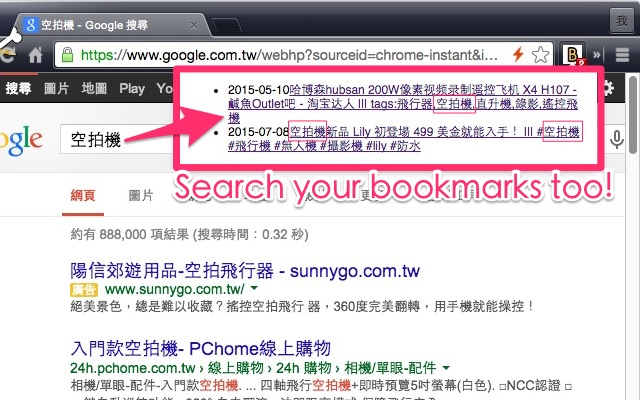

# Bookmarks Search [](https://travis-ci.org/Pleasurazy/bookmarks.search)

Bookmarks search, the google way.

Youtube.com, tw.yahoo.com, www.google.com, www.bing.com, github.com, etc, works!

# Install

Google Chrome: https://chrome.google.com/webstore/detail/bookmarks-search/oakdljgpfopdkhicnfbgbleaklilciai

# Preview



# Development

```shell
$ npm run dev
```

# Build

```shell
$ npm run build
```

# Test

```shell
$ npm test
```

```
query
  ✓ query keywords (q|search_query|query|etc) should be work
  ✓ query in the last param using hash sign
  ✓ query between url params using hash sign
  ✓ query between url params using http queryparams
  ✓ query between url params using restful params
```
